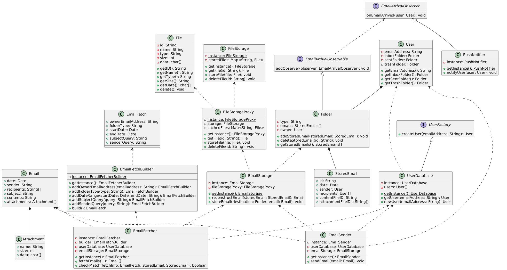
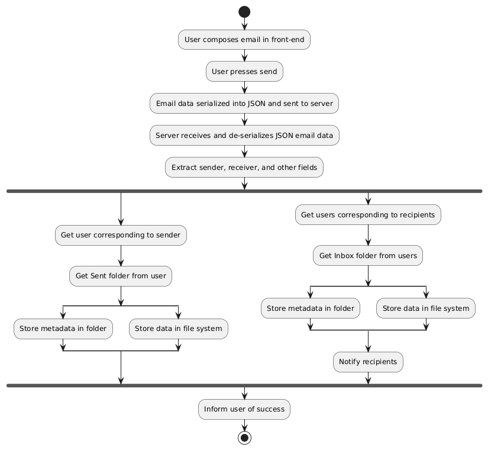
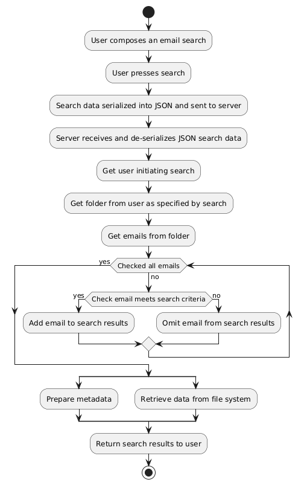
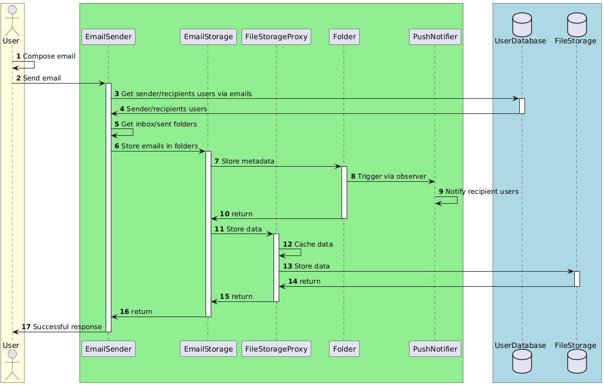
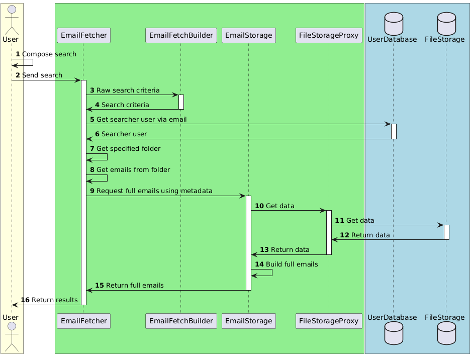

# CS 5800 - Advanced Software Engineering: Final

The following diagrams represent the back-end for a simple e-mail server.

A Markdown version of the submission may be found at [https://github.com/jcanundroid/fall-2024-cs-5800-01](https://github.com/jcanundroid/fall-2024-cs-5800-01).

## Design Patterns

Creational: Builder (EmailFetchBuilder); Singleton (EmailFetcher, EmailSender, EmailStorage, FileStorage, FileStorageProxy, UserDatabase)

Structural: Proxy (FileStorage, FileStorageProxy)

Behavioral: Observer (PushNotifier); Mediator (EmailSender)

## Class Diagram



```
@startuml

class Attachment {
  +name: String
  +size: int
  +data: char[]
}

class Email {
  +date: Date
  +sender: String
  +recipients: String[]
  +subject: String
  +contents: String
  +attachments: Attachment[]
}

interface EmailArrivalObservable {
  addObserver(observer: EmailArrivalObserver): void
}

interface EmailArrivalObserver {
  onEmailArrived(user: User): void
}

class EmailFetch {
  +ownerEmailAddress: String
  +folderType: String
  +startDate: Date
  +endDate: Date
  +subjectQuery: String
  +senderQuery: String
}

class EmailFetcher {
  {static} -instance: EmailFetcher
  -builder: EmailFetchBuilder
  -userDatabase: UserDatabase
  -emailStorage: EmailStorage
  {static} +getInstance(): EmailFetcher
  +fetchEmails(...): Email[]
  +checkMatch(fetchInfo: EmailFetch, storedEmail: StoredEmail): boolean
}

class EmailFetchBuilder {
  {static} -instance: EmailFetcherBuilder
  {static} +getInstance(): EmailFetcherBuilder
  +addOwnerEmailAddress(emailAddress: String): EmailFetchBuilder
  +addFolderType(type: String): EmailFetchBuilder
  +addDateRange(startDate: Date, endDate: String): EmailFetchBuilder
  +addSubjectQuery(query: String): EmailFetchBuilder
  +addSenderQuery(query: String): EmailFetchBuilder
  +build(): EmailFetch
}

class EmailSender {
  {static} -instance: EmailSender
  -userDatabase: UserDatabase
  -emailStorage: EmailStorage
  {static} +getInstance(): EmailSender
  +sendEmail(email: Email): void
}

class EmailStorage {
  {static} -instance: EmailStorage
  -fileStorageProxy: FileStorageProxy
  {static} +getInstance(): EmailStorage
  +reconstructEmail(storedEmail: StoredEmail): Email
  +storeEmail(destination: Folder, email: Email): void
}

class File {
  -id: String
  -name: String
  -type: String
  -size: int
  -data: char[]
  +getID(): String
  +getName(): String
  +getType(): String
  +getSize(): String
  +getData(): char[]
  +delete(): void
}

class FileStorage {
  {static} -instance: FileStorage
  -storedFiles: Map<String, File>
  {static} +getInstance(): FileStorage
  +getFile(id: String): File
  +storeFile(file: File): void
  +deleteFile(id: String): void
}

class FileStorageProxy {
  {static} -instance: FileStorageProxy
  -storage: FileStorage
  -cachedFiles: Map<String, File>
  {static} +getInstance(): FileStorageProxy
  +getFile(id: String): File
  +storeFile(file: File): void
  +deleteFile(id: String): void
}

class Folder {
  -type: String
  -emails: StoredEmails[]
  -owner: User
  +addStoredEmail(storedEmail: StoredEmail): void
  +deleteStoredEmail(id: String): void
  +getStoredEmails(): StoredEmails[]
}

class PushNotifier {
  {static} -instance: PushNotifier
  {static} +getInstance(): PushNotifier
  +notifyUser(user: User): void
}

class StoredEmail {
  +id: String
  +date: Date
  +sender: User
  +recipients: User[]
  +contentFileID: String
  +attachmentFileIDs: String[]
}

class User {
  -emailAddress: String
  -inboxFolder: Folder
  -sentFolder: Folder
  -trashFolder: Folder
  +getEmailAddress(): String
  +getInboxFolder(): Folder
  +getSentFolder(): Folder
  +getTrashFolder(): Folder
}

interface UserFactory {
  +createUser(emailAddress: String): User
}

class UserDatabase {
  {static} -instance: UserDatabase
  -users: User[]
  {static} +getInstance(): UserDatabase
  +getUser(emailAddress: String): User
  +newUser(emailAddress: String): User
}

Email *-- Attachment
Email <.. EmailFetcher
Email <.. EmailSender

EmailArrivalObservable <|-- Folder

EmailArrivalObserver <|-- PushNotifier
EmailArrivalObserver <.. EmailArrivalObservable

EmailFetch <.. EmailFetchBuilder

EmailFetchBuilder <.. EmailFetcher

EmailStorage <.. EmailFetcher
EmailStorage <.. EmailSender

File <.. FileStorageProxy

FileStorage <.. FileStorageProxy

FileStorageProxy <.. EmailStorage

Folder <.. EmailStorage
Folder *-- StoredEmail

User <.. EmailSender
User *-- Folder
User <.. UserDatabase

UserFactory <|-- UserDatabase

UserDatabase <.. EmailFetcher
UserDatabase <.. EmailSender

@enduml
```

## Activity Diagrams

### Sending Email



```
@startuml

start

:User composes email in front-end;
:User presses send;
:Email data serialized into JSON and sent to server;
:Server receives and de-serializes JSON email data;
:Extract sender, receiver, and other fields;

fork
  :Get user corresponding to sender;
  :Get Sent folder from user;
  split
    :Store metadata in folder;
  split again
    :Store data in file system;
  end split
fork again
  :Get users corresponding to recipients;
  :Get Inbox folder from users;

  split
    :Store metadata in folder;
  split again
    :Store data in file system;
  end split

  :Notify recipients;
end fork

:Inform user of success;

stop

@enduml
```

### Fetching Emails



```
@startuml

start

:User composes an email search;
:User presses search;
:Search data serialized into JSON and sent to server;
:Server receives and de-serializes JSON search data;
:Get user initiating search;
:Get folder from user as specified by search;
:Get emails from folder;

while (Checked all emails) is (no)
  if (Check email meets search criteria) then (yes)
    :Add email to search results;
  else (no)
    :Omit email from search results;
  endif
endwhile (yes)

split
  :Prepare metadata;
split again
  :Retrieve data from file system;
end split

:Return search results to user;

stop

@enduml
```

## Sequence Diagrams

### Sending Email



```
@startuml

box #LightYellow
actor User as user
end box

box #LightGreen
participant EmailSender as emailSender
participant EmailStorage as emailStorage
participant FileStorageProxy as fileStorageProxy
participant Folder as folder
participant PushNotifier as pushNotifier
end box

box #LightBlue
database UserDatabase as userDatabase
database FileStorage as fileStorage
end box

autonumber

user -> user : Compose email
user -> emailSender ++ : Send email
emailSender -> userDatabase ++ : Get sender/recipients users via emails
userDatabase -> emailSender -- : Sender/recipients users
emailSender -> emailSender : Get inbox/sent folders
emailSender -> emailStorage ++ : Store emails in folders
emailStorage -> folder ++ : Store metadata
folder -> pushNotifier : Trigger via observer
pushNotifier -> pushNotifier : Notify recipient users
folder -> emailStorage -- : return
emailStorage -> fileStorageProxy ++ : Store data
fileStorageProxy -> fileStorageProxy : Cache data
fileStorageProxy -> fileStorage ++ : Store data
fileStorage -> fileStorageProxy -- : return
fileStorageProxy -> emailStorage -- : return
emailStorage -> emailSender -- : return
emailSender -> user -- : Successful response

@enduml
```

### Fetching Emails



```
@startuml

box #LightYellow
actor User as user
end box

box #LightGreen
participant EmailFetcher as emailFetcher
participant EmailFetchBuilder as emailFetchBuilder
participant EmailStorage as emailStorage
participant FileStorageProxy as fileStorageProxy
end box

box #LightBlue
database UserDatabase as userDatabase
database FileStorage as fileStorage
end box

autonumber

user -> user : Compose search
user -> emailFetcher ++ : Send search
emailFetcher -> emailFetchBuilder ++ : Raw search criteria
emailFetchBuilder -> emailFetcher -- : Search criteria
emailFetcher -> userDatabase ++ : Get searcher user via email
userDatabase -> emailFetcher -- : Searcher user
emailFetcher -> emailFetcher : Get specified folder
emailFetcher -> emailFetcher : Get emails from folder
emailFetcher -> emailStorage ++ : Request full emails using metadata
emailStorage -> fileStorageProxy ++ : Get data
fileStorageProxy -> fileStorage ++ : Get data
fileStorage -> fileStorageProxy -- : Return data
fileStorageProxy -> emailStorage -- : Return data
emailStorage -> emailStorage : Build full emails
emailStorage -> emailFetcher -- : Return full emails
emailFetcher -> user -- : Return results

@enduml
```
